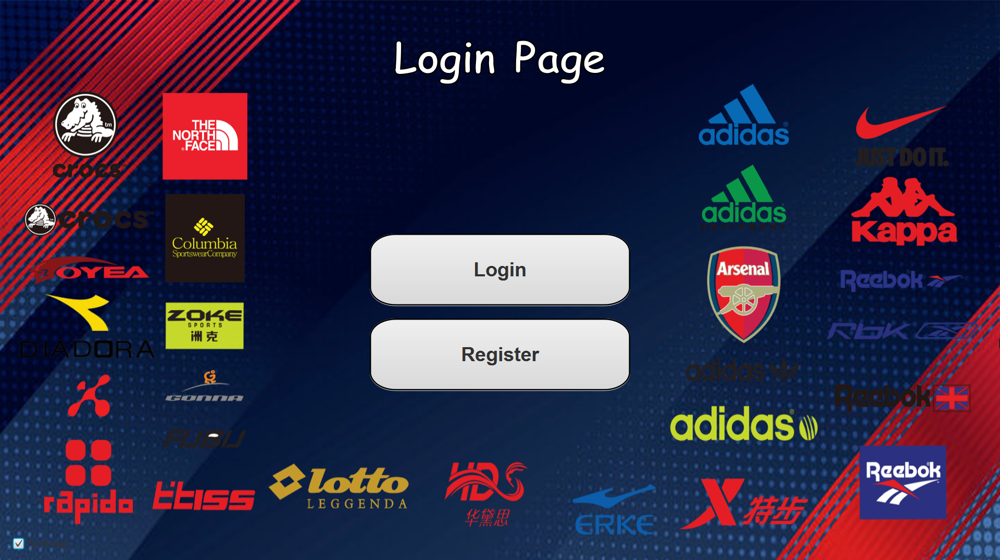
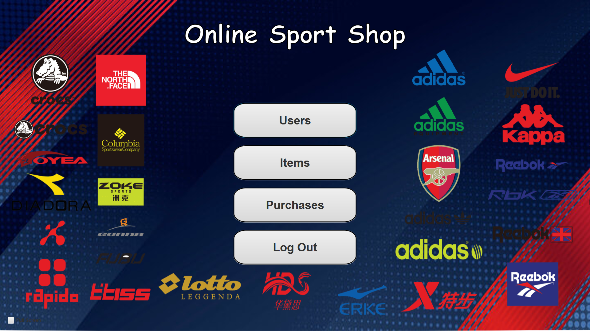
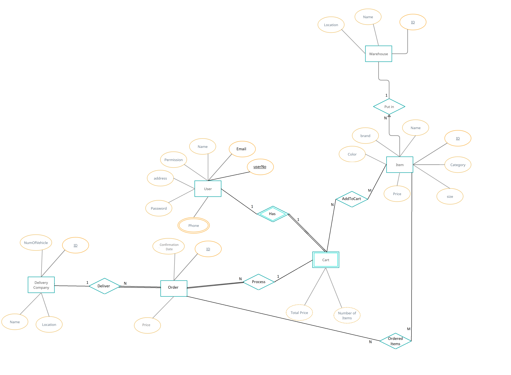

# Online Sport Shop - DataBase Systems Project
___________________________________________________________
## Project Specification
- The shop has many warehouses in different locations. The warehouse has an id, name, and location.  
-	Warehouse contains many items.  
-	The user can enter the program as an admin or as a customer.  
-	An admin has the same permission as a customer in addition to full control over the system (such as changing the quantity of a specific item).  
-	The customer can pay for more than one item and put them in a cart.  
-	The delivery company delivers the item from the warehouse to the customer.  
-	The customer has an email, name, phone, and address.  
-	The customer can have more than one phone number.  
-	The delivery company has an id, name, location, and number of vehicles.  
-	An item has an id, name, color, size, brand, and Category.  
___________________________________________________________
## Login Page

## Admin Page

## ER Diagram

